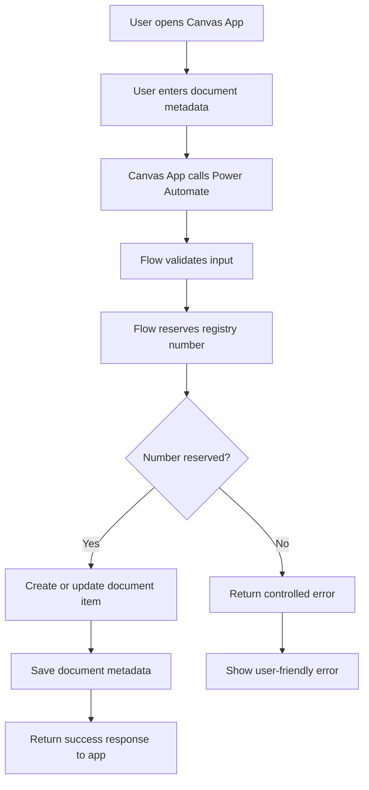

# 01 — Business Overview

## 1. Svrha dokumenta

Ovaj dokument opisuje poslovni kontekst rešenja **DocCentral v6.0**.

Cilj dokumenta je da pruži jasan pregled:

- čemu rešenje služi
- koje poslovne procese pokriva
- koji su ključni korisnici i akteri
- koji su identifikovani moduli
- koji su najvažniji poslovni rizici
- koji su obavezni enterprise zahtevi za novu verziju rešenja

Dokument je deo tehničke dokumentacije za GitHub repozitorijum i služi kao osnova za dalju arhitekturnu, funkcionalnu i razvojnu analizu.

---

## 2. Kratak opis rešenja

**DocCentral v6.0** je Power Platform rešenje za elektronsku pisarnicu i centralnu evidenciju dokumenata.

Rešenje omogućava organizaciji da evidentira, čuva, klasifikuje i obrađuje poslovne dokumente kroz kombinaciju:

- Power Apps Canvas aplikacije
- Power Automate flow-ova
- SharePoint Online lista
- SharePoint document library strukture
- centralne konfiguracione liste `AppConfig`
- mehanizma za rezervaciju / kontrolu delovodnih brojeva kroz listu `RezervisaniBrojevi`

Na osnovu dostavljenih SharePoint REST XML metadata odgovora, SharePoint Online predstavlja primarni data layer i storage layer rešenja.

---

## 3. Poslovna namena

DocCentral v6.0 je namenjen za centralizovano upravljanje dokumentima u organizaciji.

Primarna poslovna namena uključuje:

- zavođenje dokumenata
- dodelu delovodnog broja
- čuvanje dokumenata u SharePoint bibliotekama
- evidentiranje elektronskih dokumenata
- evidentiranje dokumenata pristiglih emailom
- rad sa prilozima
- centralizovanu konfiguraciju aplikacije
- export dokumenata ili izveštaja
- pripremu osnove za kontrolu pristupa, audit i dalju automatizaciju

---

## 4. Identifikovani poslovni moduli

Na osnovu dostavljenih XML metadata odgovora identifikovani su sledeći poslovni moduli.

| Modul | Opis | Status |
|---|---|---|
| Zavođenje dokumenata | Evidentiranje dokumenta i dodela delovodnog broja | Delimično potvrđeno |
| Rezervacija brojeva | Kontrola / rezervacija brojeva kroz listu `RezervisaniBrojevi` | Delimično potvrđeno |
| Centralna konfiguracija | Čuvanje konfiguracije u listi `AppConfig` | Potvrđeno |
| Dokument biblioteka | Čuvanje zavedenih dokumenata u `Shared Documents` | Potvrđeno |
| Email intake | Obrada dokumenata pristiglih emailom kroz `EmailDocuments` | Pretpostavka |
| Export | Čuvanje generisanih export fajlova u `Exports` | Pretpostavka |
| Elektronski dokumenti | Evidencija e-dokumenata kroz polja `Edokument` i `EdokumentID` | Delimično potvrđeno |

---

## 5. Identifikovane SharePoint komponente

Na osnovu dostavljenih metadata odgovora identifikovane su sledeće SharePoint komponente.

| Naziv | Tip | Namena |
|---|---|---|
| `AppConfig` | SharePoint lista | Centralna konfiguracija aplikacije |
| `RezervisaniBrojevi` | SharePoint lista | Rezervacija / kontrola delovodnih brojeva |
| `Shared Documents` | Document library | Glavna biblioteka dokumenata |
| `EmailDocuments` | Document library | Biblioteka za dokumente iz email procesa |
| `Exports` | Document library | Biblioteka za export fajlove |

---

## 6. Ključni poslovni proces

Osnovni poslovni proces rešenja može se opisati ovako:

1. Korisnik otvara Power Apps Canvas aplikaciju.
2. Korisnik unosi ili bira podatke o dokumentu.
3. Aplikacija pokreće odgovarajući Power Automate flow.
4. Flow validira podatke.
5. Flow rezerviše ili generiše delovodni broj.
6. Flow kreira ili ažurira SharePoint item / dokument.
7. Dokument se čuva u odgovarajućoj SharePoint biblioteci.
8. Korisnik dobija potvrdu o uspešnom zavođenju.
9. Sistem čuva podatke potrebne za kasniju pretragu, audit, export i obradu.

---

## 7. Ključni enterprise zahtev

Najvažniji poslovni i tehnički zahtev za DocCentral je:

> Više korisnika mora moći istovremeno da zavodi dokumenta, ali sistem nikada ne sme dozvoliti da dva dokumenta dobiju isti delovodni broj.

Ovaj zahtev ima najviši prioritet u postojećoj analizi i u planiranju nove verzije rešenja.

---

## 8. Poslovno značenje delovodnog broja

Delovodni broj predstavlja centralni identifikator zavedenog dokumenta.

Zbog toga delovodni broj mora biti:

- jedinstven
- stabilan
- nepovratan nakon finalnog zavođenja
- auditabilan
- generisan kontrolisano
- zaštićen od race condition problema
- zaštićen od ručnih i paralelnih grešaka
- povezan sa dokumentom i pripadajućim metapodacima

Dupliranje delovodnog broja predstavlja kritičan poslovni i tehnički rizik.

---

## 9. Pravila za novu verziju

Za novu enterprise verziju rešenja važe sledeća pravila:

- Canvas aplikacija ne sme samostalno da garantuje jedinstvenost delovodnog broja.
- Konačno generisanje i rezervacija broja moraju biti server-side proces.
- Power Automate ili budući backend servis mora centralizovano kontrolisati brojanje.
- Mora postojati concurrency-safe mehanizam.
- Mora postojati retry logika.
- Mora postojati audit log.
- Mora postojati jasan error response ako broj ne može biti rezervisan.
- Finalno polje za delovodni broj mora imati zaštitu od duplikata.
- Korisnik mora dobiti jasan status uspeha ili neuspeha.

---

## 10. Poslovni akteri

Na osnovu dostupnih informacija mogu se identifikovati sledeći tipovi korisnika.

| Akter | Opis | Status |
|---|---|---|
| Korisnik pisarnice | Zavodi dokumente i unosi osnovne podatke | Pretpostavka |
| Administrator aplikacije | Održava konfiguraciju i pravila rada | Pretpostavka |
| Poslovni korisnik | Pregleda dokumente i njihove metapodatke | Pretpostavka |
| Power Platform administrator | Održava Power Apps, Power Automate i konekcije | Pretpostavka |
| SharePoint administrator | Održava liste, biblioteke, prava i strukturu sajta | Pretpostavka |

Napomena: konkretne role, grupe i permission model nisu potvrđeni u dostavljenim XML metadata odgovorima. Biće obrađeni u posebnom dokumentu `09-security-permissions.md`.

---

## 11. Granice sistema

### 11.1 U okviru sistema

DocCentral v6.0 obuhvata:

- unos podataka o dokumentima
- zavođenje dokumenata
- čuvanje dokumenata
- rad sa centralnom konfiguracijom
- rad sa dokument bibliotekama
- rad sa email dokumentima
- rad sa export fajlovima
- kontrolu / rezervaciju brojeva
- Power Platform automatizaciju

### 11.2 Van trenutnog opsega potvrđenih informacija

Sledeće oblasti nisu potvrđene iz dostavljenih podataka:

- kompletna Power Apps logika
- nazivi ekrana u aplikaciji
- kolekcije u Canvas aplikaciji
- Power Automate flow logika
- svi triggeri
- konekcije i connection references
- permission model
- lifecycle management
- deployment strategija
- integracije sa eksternim sistemima
- kompletan sadržaj `AppConfig.Config` JSON strukture

Ove oblasti treba dodatno analizirati nakon dostavljanja Power Platform solution ZIP fajla i konfiguracija SharePoint lista.

---

## 12. Poslovni rizici

| Rizik | Uticaj | Prioritet |
|---|---|---|
| Dupliranje delovodnog broja | Kritičan poslovni incident | Kritično |
| Generisanje broja u Canvas aplikaciji | Race condition i nekonzistentnost | Kritično |
| Nedostatak atomic locking mehanizma | Paralelni upisi mogu proizvesti greške | Kritično |
| Nedostatak audit loga | Teško dokazivanje toka događaja | Visoko |
| Nedokumentovana konfiguracija | Teško održavanje i razvoj | Visoko |
| SharePoint threshold problemi | Pad performansi kod većeg broja stavki | Visoko |
| Nejasan permission model | Rizik od preširokog pristupa | Visoko |
| Flow timeout / throttling | Nestabilan rad procesa | Srednje do visoko |

---

## 13. Pretpostavljeni poslovni tok za zavođenje dokumenta

---

## 14. Poslovni zaključak

DocCentral v6.0 je poslovno kritično rešenje za elektronsku pisarnicu i upravljanje dokumentima.

Najvažnija vrednost sistema je centralizacija dokumenata i kontrolisano zavođenje kroz delovodni broj.

Najveći rizik sistema je mogućnost da u paralelnom radu dva korisnika dobiju isti delovodni broj.

Zbog toga nova verzija mora tretirati generisanje delovodnog broja kao centralni enterprise servis, a ne kao lokalnu logiku aplikacije.

---

## 15. Otvorena pitanja

Sledeća pitanja treba razjasniti u nastavku analize:

1. Koji Power Automate flow trenutno generiše ili rezerviše delovodni broj?
2. Da li `RezervisaniBrojevi` trenutno ima unique constraint?
3. Da li `Shared Documents.DelovodniBroj` ima unique constraint?
4. Da li postoji posebna lista za audit log?
5. Da li se delovodni broj generiše po godini, tipu dokumenta, organizacionoj jedinici ili knjizi?
6. Da li se broj može poništiti, stornirati ili osloboditi?
7. Šta se dešava ako korisnik započne zavođenje, ali ne završi proces?
8. Da li postoje različite delovodne knjige?
9. Da li email dokumenti automatski ulaze u proces zavođenja?
10. Koje korisničke role postoje u aplikaciji?

---

## 16. Status dokumenta

| Stavka | Vrednost |
|---|---|
| Naziv dokumenta | `01-business-overview.md` |
| Rešenje | DocCentral v6.0 |
| Status | Draft |
| Izvor | Dostavljeni SharePoint REST XML metadata odgovori |
| Sledeći dokument | `02-current-architecture.md` |
