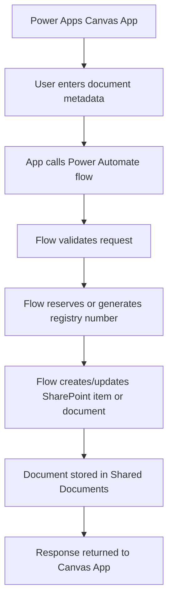
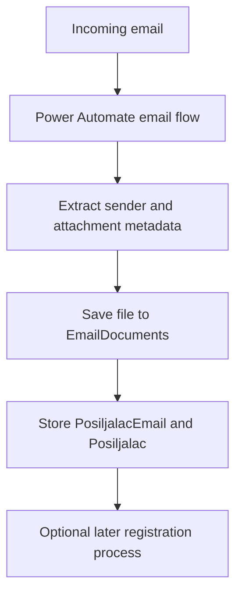
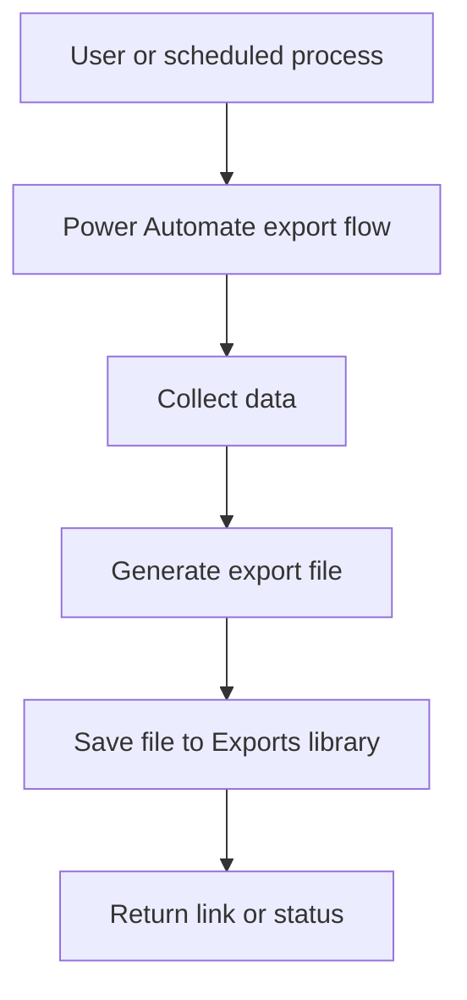
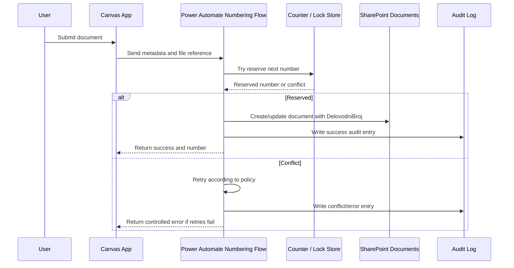

# 02 — Current Architecture

## 1. Svrha dokumenta

Ovaj dokument opisuje trenutno identifikovanu arhitekturu rešenja **DocCentral v6.0**.

Cilj dokumenta je da prikaže:

- glavne komponente sistema
- odnos između Power Apps, Power Automate i SharePoint Online sloja
- identifikovane SharePoint liste i biblioteke
- pretpostavljene tokove podataka
- kritične arhitekturne rizike
- oblasti koje nisu potvrđene iz dostavljenih podataka

Dokument je zasnovan na dostavljenim SharePoint REST XML metadata odgovorima.

---

## 2. Status analize

| Oblast | Status |
|---|---|
| SharePoint site URL | Potvrđeno |
| SharePoint liste i biblioteke | Delimično potvrđeno |
| Kolone u identifikovanim listama/bibliotekama | Delimično potvrđeno |
| Power Apps Canvas aplikacija | Nepoznato |
| Power Automate flow-ovi | Nepoznato |
| Connection references | Nepoznato |
| Environment variables | Nepoznato |
| Security / permissions | Nepoznato |
| Kompletan poslovni tok | Delimično pretpostavljeno |

---

## 3. Identifikovani SharePoint site

Identifikovani SharePoint site:

```text
https://goprobeograd.sharepoint.com/sites/DocumentCentralv6.0
```

REST API base URL:

```text
https://goprobeograd.sharepoint.com/sites/DocumentCentralv6.0/_api/
```

Zaključak:

SharePoint Online predstavlja centralni storage i data layer za trenutno analizirane komponente.

---

## 4. Visok nivo trenutne arhitekture

Trenutna arhitektura se može opisati kao Power Platform rešenje koje koristi SharePoint Online kao primarni backend.

```text
Power Apps Canvas App
        |
        | korisnički unos / prikaz / pozivi flow-ova
        v
Power Automate flows
        |
        | validacija / kreiranje / ažuriranje / poslovna logika
        v
SharePoint Online
        |
        | liste + document libraries
        v
Dokumenti, konfiguracija, delovodni brojevi, email dokumenti, exporti
```

Status: **delimično potvrđeno**

Obrazloženje:

- SharePoint struktura je potvrđena kroz XML metadata.
- Postojanje Canvas aplikacije i flow-ova proizlazi iz opisa rešenja i prethodnih pravila projekta.
- Konkretni nazivi aplikacije, ekrana i flow-ova nisu potvrđeni dostavljenim XML-om.

---

## 5. Glavne arhitekturne komponente

| Komponenta | Tehnologija | Uloga | Status |
|---|---|---|---|
| Korisnički interfejs | Power Apps Canvas App | Unos i prikaz podataka | Pretpostavljeno |
| Orkestracija procesa | Power Automate | Validacija, upis, generisanje brojeva, rad sa dokumentima | Pretpostavljeno |
| Data layer | SharePoint Online lists | Čuvanje strukturiranih podataka | Potvrđeno |
| Storage layer | SharePoint document libraries | Čuvanje dokumenata i fajlova | Potvrđeno |
| Konfiguracioni sloj | `AppConfig` lista | Centralna konfiguracija aplikacije | Potvrđeno |
| Numbering sloj | `RezervisaniBrojevi` lista | Rezervacija / kontrola delovodnih brojeva | Delimično potvrđeno |
| Email intake sloj | `EmailDocuments` biblioteka | Dokumenti pristigli iz email procesa | Pretpostavljeno |
| Export sloj | `Exports` biblioteka | Generisani export fajlovi | Pretpostavljeno |

---

## 6. Identifikovane liste i biblioteke

### 6.1 `AppConfig`

Tip: SharePoint lista

Scope:

```text
/sites/DocumentCentralv6.0/Lists/AppConfig
```

Namena:

Centralna konfiguracija aplikacije.

Potvrđena ključna polja:

| Internal name | Tip | Namena |
|---|---|---|
| `Title` | Single line of text | Naziv konfiguracionog zapisa |
| `Config` | Multiple lines of text | Konfiguracioni sadržaj |
| `ColumnHeader` | Multiple lines of text | Konfiguracija zaglavlja / prikaza |
| `ID` | Counter | SharePoint ID |
| `Created` | Date and Time | Datum kreiranja |
| `Modified` | Date and Time | Datum izmene |
| `Author` | Person or Group | Kreirao |
| `Editor` | Person or Group | Izmenio |

Arhitekturna uloga:

`AppConfig` je centralno mesto za konfiguracije koje aplikacija verovatno učitava pri pokretanju ili tokom rada.

Nepoznato:

- tačan JSON format u koloni `Config`
- da li postoji više konfiguracionih tipova
- da li se koristi za prevode
- da li se koristi za podešavanja delovodnih knjiga
- da li se koristi za permisije
- da li se koristi za UI konfiguraciju

---

### 6.2 `RezervisaniBrojevi`

Tip: SharePoint lista

Scope:

```text
/sites/DocumentCentralv6.0/Lists/RezervisaniBrojevi
```

Namena:

Lista najverovatnije služi za rezervaciju ili kontrolu delovodnih brojeva.

Potvrđena ključna polja:

| Internal name | Tip | Namena |
|---|---|---|
| `Title` | Single line of text | Naziv / opis zapisa |
| `RezervisaniBroj` | Number | Rezervisani broj |
| `DatumRezervacije` | Date and Time | Datum rezervacije |
| `ID` | Counter | SharePoint ID |
| `Created` | Date and Time | Datum kreiranja |
| `Modified` | Date and Time | Datum izmene |
| `Author` | Person or Group | Kreirao |
| `Editor` | Person or Group | Izmenio |

Arhitekturna uloga:

Ova lista je kritična za proces generisanja i kontrole delovodnih brojeva.

Nepoznato:

- da li ima unique constraint
- da li se koristi kao lock tabela
- da li se koristi kao istorija rezervisanih brojeva
- da li se broj briše ako proces ne uspe
- da li postoji status rezervacije
- da li postoji veza ka dokumentu
- da li postoji godina / knjiga / tip dokumenta
- da li se koristi u Power Automate flow-u ili direktno iz Power Apps-a

---

### 6.3 `Shared Documents`

Tip: SharePoint document library

Scope:

```text
/sites/DocumentCentralv6.0/Shared Documents
```

Namena:

Glavna biblioteka za čuvanje dokumenata.

Potvrđena ključna polja:

| Internal name | Tip | Namena |
|---|---|---|
| `FileLeafRef` | File | Naziv fajla |
| `Title` | Single line of text | Title metadata |
| `_ExtendedDescription` | Multiple lines of text | Opis dokumenta |
| `DelovodniBroj` | Single line of text | Delovodni broj dokumenta |
| `EdokumentID` | Single line of text | Identifikator e-dokumenta |
| `Edokument` | Yes/No | Oznaka da li je elektronski dokument |
| `Attachment` | Yes/No | Oznaka da li je prilog |
| `MediaServiceImageTags` | Managed Metadata | Image tags |
| `ContentType` | Computed | Content type |

Arhitekturna uloga:

`Shared Documents` je centralni document storage za zavedene dokumente.

Kritična napomena:

Polje `DelovodniBroj` postoji u biblioteci i treba da bude zaštićeno od duplikata ako se koristi kao finalni identifikator dokumenta.

Nepoznato:

- da li je `DelovodniBroj` indexed
- da li je `DelovodniBroj` unique
- da li se fajl prvo uploaduje pa zatim dobija metadata
- da li se dokument kreira iz aplikacije ili flow-a
- da li postoje folderi
- da li se koristi Content Type logika

---

### 6.4 `EmailDocuments`

Tip: SharePoint document library

Scope:

```text
/sites/DocumentCentralv6.0/EmailDocuments
```

Namena:

Biblioteka za dokumente iz email procesa.

Potvrđena ključna polja:

| Internal name | Tip | Namena |
|---|---|---|
| `FileLeafRef` | File | Naziv fajla |
| `Title` | Single line of text | Title metadata |
| `_ExtendedDescription` | Multiple lines of text | Opis |
| `PosiljalacEmail` | Single line of text | Email pošiljaoca |
| `Posiljalac` | Single line of text | Naziv pošiljaoca |
| `MediaServiceImageTags` | Managed Metadata | Image tags |
| `ContentType` | Computed | Content type |

Arhitekturna uloga:

`EmailDocuments` verovatno služi kao ulazni kanal za dokumente dobijene emailom.

Nepoznato:

- koji flow puni ovu biblioteku
- da li se dokumenti iz ove biblioteke kasnije zavode
- da li se iz email metapodataka automatski kreira predmet
- da li postoji veza između `EmailDocuments` i `Shared Documents`

---

### 6.5 `Exports`

Tip: SharePoint document library

Scope:

```text
/sites/DocumentCentralv6.0/Exports
```

Namena:

Biblioteka za exportovane fajlove ili generisane izveštaje.

Potvrđena ključna polja:

| Internal name | Tip | Namena |
|---|---|---|
| `FileLeafRef` | File | Naziv fajla |
| `Title` | Single line of text | Title metadata |
| `_ExtendedDescription` | Multiple lines of text | Opis |
| `ContentType` | Computed | Content type |

Arhitekturna uloga:

`Exports` služi kao storage sloj za generisane fajlove.

Nepoznato:

- koji proces kreira export
- format export fajlova
- da li export sadrži dokumente, izveštaje ili logove
- da li se fajlovi automatski brišu ili arhiviraju

---

## 7. Pretpostavljeni tok podataka za zavođenje dokumenta



Status: **pretpostavka**

Razlog:

Dostavljeni XML potvrđuje SharePoint strukturu, ali ne potvrđuje kompletnu Power Automate logiku.

---

## 8. Pretpostavljeni tok za email dokumente



Status: **pretpostavka**

Razlog:

Biblioteka `EmailDocuments` i polja `PosiljalacEmail` i `Posiljalac` ukazuju na email intake proces, ali sam flow nije dostavljen.

---

## 9. Pretpostavljeni tok za export



Status: **pretpostavka**

Razlog:

Biblioteka `Exports` je potvrđena, ali logika generisanja export fajlova nije dostavljena.

---

## 10. Arhitekturna uloga `AppConfig`

`AppConfig` je centralna tačka konfiguracije.

U enterprise arhitekturi ova lista može sadržati:

- sistemska podešavanja
- delovodne knjige
- prevode
- UI konfiguraciju
- mapiranje kolona
- pravila za tipove dokumenata
- dozvoljene vrednosti
- korisničke ili grupne konfiguracije
- konfiguraciju procesa
- parametre za flow-ove

Trenutno je potvrđeno samo da postoje kolone:

- `Title`
- `Config`
- `ColumnHeader`

Nije potvrđen konkretan sadržaj konfiguracije.

---

## 11. Arhitekturna uloga `RezervisaniBrojevi`

Lista `RezervisaniBrojevi` mora se tretirati kao kritična komponenta.

Ukoliko se koristi za generisanje ili rezervaciju delovodnih brojeva, mora imati sledeće osobine:

- kontrolu konkurentnosti
- audit upisa
- zaštitu od duplikata
- retry mehanizam
- jasnu vezu ka finalnom dokumentu
- status rezervacije
- datum i vreme rezervacije
- korisnika koji je inicirao rezervaciju

Trenutno dostavljeni metadata potvrđuje samo sledeća poslovna polja:

- `RezervisaniBroj`
- `DatumRezervacije`
- `Title`

To nije dovoljno za robustan enterprise numbering servis.

---

## 12. Kritična arhitekturna tačka: delovodni broj

Delovodni broj je najkritičniji deo arhitekture.

Zahtev:

> Više korisnika mora moći istovremeno da zavodi dokumenta, ali sistem nikada ne sme dozvoliti da dva dokumenta dobiju isti delovodni broj.

Arhitekturna posledica:

Canvas aplikacija ne sme biti mesto koje garantuje jedinstvenost broja.

Jedinstvenost mora biti obezbeđena u backend sloju:

- Power Automate flow
- SharePoint unique constraint
- optimistic locking
- atomic update
- retry logic
- audit log

---

## 13. Trenutni arhitekturni rizici

| Rizik | Opis | Prioritet |
|---|---|---|
| Race condition pri generisanju broja | Paralelni korisnici mogu pokušati da rezervišu isti broj | Kritično |
| Nepoznato da li postoji unique constraint | Nije potvrđeno da SharePoint sprečava duplikate | Kritično |
| Nedovoljno polja u `RezervisaniBrojevi` | Ne postoji potvrđen status, korisnik, veza ka dokumentu | Visoko |
| Nepoznata Power Automate logika | Nije moguće potvrditi da flow radi concurrency-safe | Visoko |
| Nepoznat permission model | Nije poznato ko može da čita/piše u liste | Visoko |
| Potencijalna logika u Canvas aplikaciji | Ako aplikacija računa broj, postoji rizik od duplikata | Kritično |
| SharePoint performance limits | Rizik kod velikog broja dokumenata i nedelegabilnih upita | Visoko |
| Nedokumentovan `AppConfig` JSON | Teško održavanje i migracija | Visoko |

---

## 14. Preporučeni target princip za novu arhitekturu

Za novu verziju rešenja preporučuje se sledeći princip:

```text
Canvas App = UI layer
Power Automate / backend = business logic layer
SharePoint = data and document storage layer
```

Canvas App sme da:

- prikazuje podatke
- validira osnovna obavezna polja
- poziva flow
- prikazuje rezultat
- osvežava podatke

Canvas App ne sme da:

- finalno generiše delovodni broj
- garantuje jedinstvenost broja
- direktno radi kritične upise ako korisnici imaju read-only prava
- rešava race condition lokalnom logikom

Power Automate / backend mora da:

- validira zahtev
- generiše / rezerviše delovodni broj
- izvrši atomic ili optimistic update
- upiše dokument
- vrati kontrolisan odgovor
- vodi audit log

---

## 15. Preporučeni target tok za numbering servis



---

## 16. Potvrđene činjenice

- Postoji SharePoint site `DocumentCentralv6.0`.
- Postoji lista `AppConfig`.
- `AppConfig` ima polja `Config` i `ColumnHeader`.
- Postoji lista `RezervisaniBrojevi`.
- `RezervisaniBrojevi` ima polja `RezervisaniBroj` i `DatumRezervacije`.
- Postoji document library `Shared Documents`.
- `Shared Documents` ima polje `DelovodniBroj`.
- `Shared Documents` ima polja `Edokument`, `EdokumentID` i `Attachment`.
- Postoji document library `EmailDocuments`.
- `EmailDocuments` ima polja `PosiljalacEmail` i `Posiljalac`.
- Postoji document library `Exports`.

---

## 17. Pretpostavke

- Power Apps Canvas aplikacija koristi SharePoint i Power Automate.
- Power Automate flow-ovi rade kreiranje i ažuriranje dokumenata.
- `AppConfig.Config` sadrži JSON konfiguraciju.
- `RezervisaniBrojevi` se koristi za kontrolu delovodnih brojeva.
- `EmailDocuments` se koristi za email intake proces.
- `Exports` se koristi za export fajlove.
- `Shared Documents` je glavna biblioteka za zavedene dokumente.

---

## 18. Nepoznato

- Naziv Canvas aplikacije.
- Lista ekrana u aplikaciji.
- Kolekcije u aplikaciji.
- OnStart / App.Formulas logika.
- Flow-ovi i njihovi triggeri.
- Connection references.
- Environment variables.
- Da li korisnici imaju direktna prava upisa u SharePoint.
- Da li su finalni upisi isključivo preko Power Automate-a.
- Da li postoji audit lista.
- Da li postoji lock lista.
- Da li `DelovodniBroj` ima unique constraint.
- Da li `RezervisaniBroj` ima unique constraint.
- Da li postoji retry logika.
- Da li postoji error handling standard.
- Da li postoje DLP / environment governance pravila.

---

## 19. Zaključak

Trenutno identifikovana arhitektura pokazuje da je DocCentral v6.0 Power Platform rešenje oslonjeno na SharePoint Online kao data i storage layer.

Glavna potvrđena struktura obuhvata:

- `AppConfig`
- `RezervisaniBrojevi`
- `Shared Documents`
- `EmailDocuments`
- `Exports`

Najkritičnija arhitekturna oblast je generisanje i rezervacija delovodnog broja.

Za enterprise verziju rešenja potrebno je obavezno projektovati centralizovan, concurrency-safe numbering servis koji sprečava duplikate i omogućava paralelan rad više korisnika.

---

## 20. Sledeći dokument

Sledeći dokument u dokumentaciji:

```text
03-sharepoint-data-model.md
```

Taj dokument treba detaljno da opiše SharePoint data model, kolone, tipove podataka, rizike i preporučene izmene.
